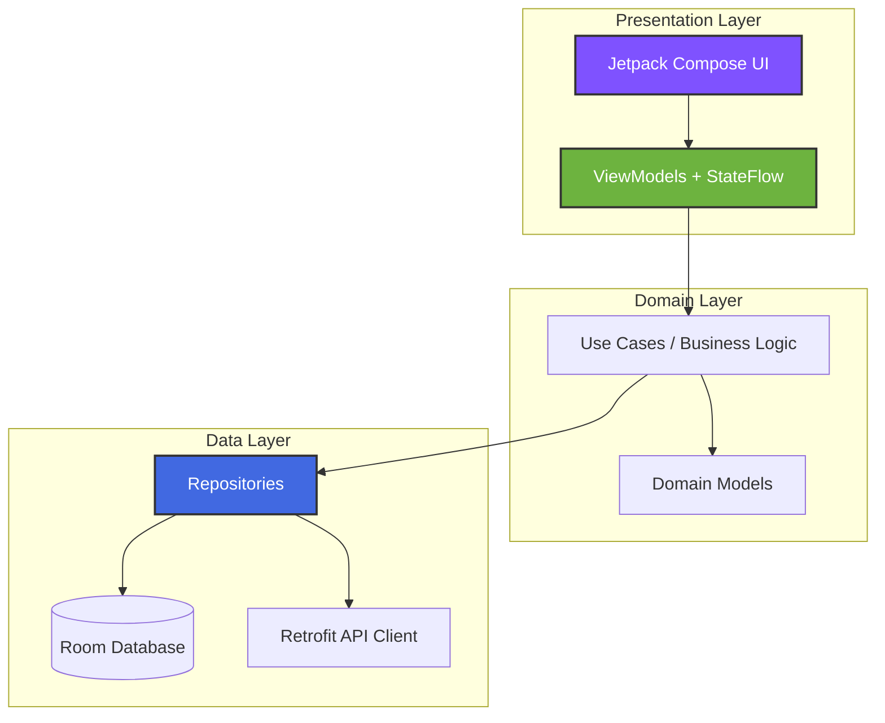
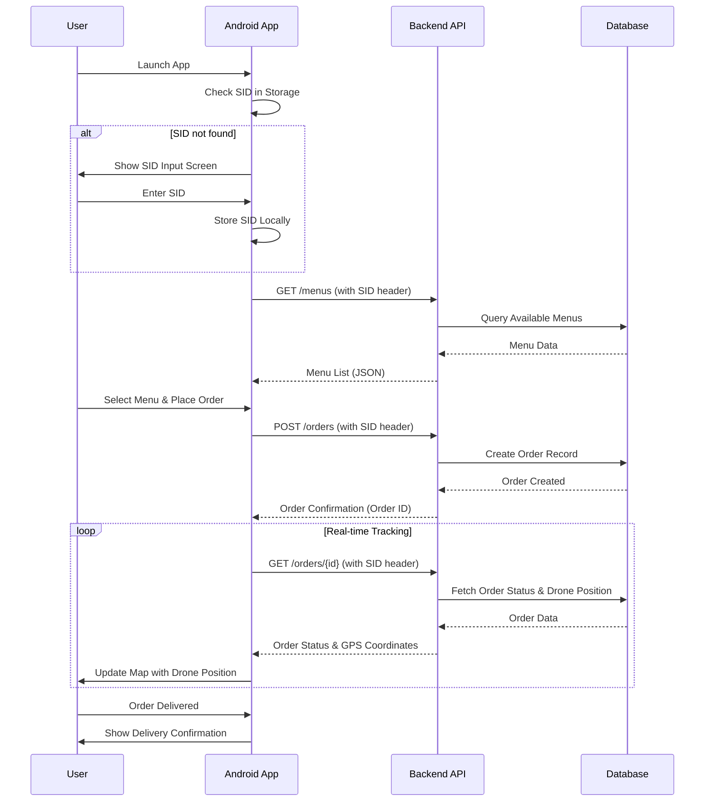

<div align="center">
  
  <h1>Fast Eat</h1>
  <p><i>Kotlin Android Client</i></p>
</div>

---

An Android application built with Kotlin and Jetpack Compose that demonstrates modern Android development practices. Browse restaurant menus, place orders, and track real-time drone deliveries on an interactive map.

**Quick Navigation:** [Spring Boot Backend](https://github.com/gerolori/fast-eat-backend-springboot) • [Kotlin Android App](https://github.com/gerolori/fast-eat-kotlin) • [React Native App](https://github.com/gerolori/fast-eat-react-native) • [Architecture](https://github.com/gerolori/fast-eat-architecture) • [API Spec](https://github.com/gerolori/fast-eat-architecture/blob/main/api/openapi.yaml)

---

## Screenshots

| Onboarding | Menu List | Menu Detail |
| --- | --- | --- |
| *(Login / Session)* (Coming Soon) | *(Browse restaurants)* (Coming Soon) | *(Menu ingredients)* (Coming Soon) |

| Order Confirmation | Live Tracking | Profile |
| --- | --- | --- |
| *(Place order)* (Coming Soon) | *(Drone map)* (Coming Soon) | *(User details)* (Coming Soon) |

---

## Tech Stack

| Layer | Technology |
| --- | --- |
| Language | Kotlin 2.3.10 with Coroutines |
| UI Framework | Jetpack Compose (Declarative UI) |
| Design System | Material Design 3 |
| Architecture | MVVM (Model-View-ViewModel) |
| Navigation | Navigation Compose with type-safe routes |
| Maps | Google Maps SDK for Android |
| Location | Android Location API + Google Play Services |
| Local Storage | Room Database + SharedPreferences |
| Networking | Retrofit 2 + OkHttp |
| Async | Kotlin Coroutines + Flow |

---

## Architecture

The project follows an **MVVM** (Model–View–ViewModel) pattern with Clean Architecture principles:



### Project Structure

```
app/src/main/java/com/example/mangiaebasta/
├── data/
│   ├── local/
│   │   ├── dao/
│   │   └── database/
│   ├── remote/
│   │   ├── api/
│   │   └── dto/
│   └── repository/
├── domain/
│   ├── model/
│   └── usecase/
├── ui/
│   ├── theme/
│   ├── screens/
│   │   ├── menu/
│   │   ├── order/
│   │   ├── profile/
│   │   └── onboarding/
│   └── components/
└── di/
    └── AppModule.kt
```

### Architectural Patterns

- **StateFlow/Flow:** Reactive state management with Kotlin Flow for UI updates
- **Jetpack Compose:** Declarative UI with composable functions and remember/mutableState
- **Material3 Theming:** Custom teal palette (Main=#1AB2B2, MainMid=#10827C, MainDark=#0A5C53)
- **Repository Pattern:** Data source abstraction with single source of truth
- **Dependency Injection:** Manual DI with object modules (or Hilt/Koin for larger projects)

---

## Getting Started

### Prerequisites

- **Android Studio:** Hedgehog (2023.1.1) or later
- **JDK:** Version 17 or higher
- **Android SDK:** API Level 31+ (Target: API 36)
- **Emulator:** Pixel 7 recommended (API 36, Android 15)

### Installation

1. Clone the repository

   ```bash
   git clone https://github.com/gerolori/fast-eat-kotlin.git
   cd fast-eat-kotlin
   ```

2. Configure Local Properties
   - Copy `local.properties.example` to `local.properties`
   - Add your API credentials:

     ```properties
     API_BASE_URL=http://localhost:8080/api/v1
     GOOGLE_MAPS_API_KEY=your_google_maps_api_key
     ```

3. Sync Project with Gradle Files
   - Open project in Android Studio
   - Wait for Gradle sync to complete
   - Download any missing SDK components

### Run

```bash
# Build the project
./gradlew build

# Install on connected device/emulator
./gradlew installDebug

# Run directly from Android Studio
# Click "Run" button or press Shift+F10
```

### Running Tests

```bash
# Unit tests
./gradlew test

# Instrumented tests (Android device/emulator required)
./gradlew connectedAndroidTest
```

---

## Screens & Features

| Screen | Description |
| --- | --- |
| **Splash Screen** | App initialization with logo animation |
| **First Launch** | Session ID (SID) input for API authentication |
| **Menu List** (`MenuPage`) | Browse available menus with filtering by distance/ETA |
| **Menu Detail** (`MenuDetailsPage`) | View menu information, ingredients, and pricing |
| **Order Confirmation** (`ConfirmOrderPage`) | Review order details and place order |
| **Active Order** (`OrderPage`) | Real-time order status with ETA countdown |
| **Order Tracking** | Live map showing drone position and delivery route |
| **Profile Info** (`ProfilePage`) | View user details and order history |
| **Profile Form** (`ProfileForm`) | Edit personal information and payment card details |

---

## Features & Business Rules (Epic Breakdown)

### EP-01: Menu Discovery & Ordering

**User Story:** As a user, I want to browse nearby restaurant menus and place orders so I can get food delivered by drone.

**Acceptance Criteria:**

- Browse available menus from nearby restaurants
- Filter by flight distance and ETA
- View detailed menu information with high-resolution images
- One-click ordering with input validation
- Business constraints: Cannot order if a previous order is pending, user must complete profile information before ordering
- Technologies: Compose UI, Room Database, Retrofit networking

**Technical Notes:**

- Menus fetched from `/menus` endpoint with GPS coordinates
- Images stored as Base64 strings in Room Database (ImagesDao)
- Order validation checks for pending orders via `/orders/{id}` status
- Profile completion validated before allowing order placement

### EP-02: User Profile Management

**User Story:** As a user, I want to manage my profile and payment information so I can complete orders efficiently.

**Acceptance Criteria:**

- Edit personal information (name, surname - max 15 chars)
- Manage credit card details with validation (max 31 chars for card number)
- View order history with last order details
- Technologies: DataStore, form validation, secure storage

**Technical Notes:**

- Profile data persisted in SharedPreferences/DataStore
- Form validation using Compose state management
- Card number validation (Luhn algorithm optional)
- Last order fetched from `/orders/history` endpoint

### EP-03: Real-time Order Tracking

**User Story:** As a user, I want to track my order in real-time so I know when my food will arrive.

**Acceptance Criteria:**

- Live order status (pending → in progress → delivered)
- Interactive map showing restaurant departure point, drone position, and delivery destination
- Real-time ETA updates
- Order cancellation capability
- Order history with delivery confirmations
- Technologies: Google Maps SDK, Coroutines, Location Services

**Technical Notes:**

- Order status polled via `/orders/{id}` endpoint using Kotlin coroutines
- Google Maps SDK displays drone position with custom markers
- ETA calculated from drone speed and distance to destination
- Cancellation sends DELETE request to `/orders/{id}/cancel`

---

## Technical Implementation Notes

### General Implementation

- First app launch asks for SID and stores it locally for use in every server call
- Application maintains last visited page state when returning to it
- All images are square and Base64 encoded (no HTML prefix)
- Developed and tested on Pixel 7 API 36

### API Integration

The application communicates with a backend API for all data operations.

**Complete API documentation:** See the [Architecture Repository - API Specification](https://github.com/gerolori/fast-eat-architecture#api-specification) for endpoint specifications, request/response schemas, and authentication details.

**Implementation:** The app uses Retrofit 2 with OkHttp for HTTP communication. All requests require JWT authentication via the `Authorization` header.

### State Management

- **ViewModels:** Hold UI state and business logic, survive configuration changes
- **StateFlow:** Reactive state container for UI updates (collectAsState in Compose)
- **Flow:** Asynchronous data streams for API responses and database queries
- **Coroutines:** Structured concurrency for network calls and background work

### Navigation

- **Navigation Compose:** Type-safe navigation with composable destinations
- **Route Management:** Centralized route definitions with parameter passing
- **Back Stack:** Automatic back navigation handling with system back button
- **Deep Linking:** Support for navigation from notifications (future enhancement)

### Material3 Theming

The app uses a custom teal color palette:

- **Main:** `#1AB2B2` - Primary buttons, active states, brand elements
- **MainMid:** `#10827C` - Hover states, secondary accents
- **MainDark:** `#0A5C53` - Text on light backgrounds, depth

Material3 components adapt these colors to light/dark modes with elevation and surface tinting.

### Client-Server Sequence



---

## Code Quality and Best Practices

The project follows SOLID principles:

- Single Responsibility: Feature-based modular architecture
- Open/Closed: Extension via composition and inheritance
- Liskov Substitution: Interface-based dependencies
- Interface Segregation: Typed repositories and data sources
- Dependency Inversion: Abstract layer dependencies

Reactive programming approach:

- Coroutines for async operations
- StateFlow for reactive state management
- Flow for data streams

Material Design 3 implementation:

- Consistent theming with custom colors
- Adaptive typography
- Modern component library

Type safety:

- Null-safe Kotlin with optional types
- Sealed classes for error handling
- Compile-time checked serialization

---

## Performance Optimizations

- Image caching via DAO to reduce network requests
- Database indexing with Room schema optimization
- Efficient Compose rendering with lazy loading
- Proper coroutine scope management with lifecycle awareness

---

## Security Considerations

- API credentials managed via `local.properties` (excluded from version control)
- Card data handled with PCI-DSS compliance considerations
- Location data requires runtime permissions with user consent
- Session management using secure session ID (SID) storage

---

## Testing

The project includes unit tests, integration tests, and UI tests:

- Unit tests for data layer and utility functions
- Integration tests for Room database operations
- UI tests for Compose component interactions
- Mock data fixtures for test isolation

**Testing Stack:**

- JUnit 4 for unit testing
- Mockito for test mocking
- Espresso for UI testing
- Room in-memory database for integration tests

---

## Learning Outcomes

This project demonstrates experience with:

- Advanced Kotlin features (coroutines, sealed classes, extension functions)
- Modern Android architecture with Jetpack libraries
- API integration patterns
- Database design with Room ORM
- Reactive programming with StateFlow and Flow
- UI implementation with Jetpack Compose
- Real-world app features (maps, location)
- Testing best practices
- Version control and git workflow

---

## Course Information

**Course:** Mobile Computing  
**University:** Università degli Studi di Milano  
**Academic Year:** 2024/25

**Original API:** Provided by professor for examination purposes (closed after exam period)  
**Current Backend:** [Spring Boot reimplementation](https://github.com/gerolori/fast-eat-backend-springboot)

---

## License

This project is for educational and portfolio purposes.

**Important Notes:**

- All data (menus, restaurants, user information, payment cards) is fictional
- No real payment processing is implemented (simulated validation only)
- Original course API design by the professor; implementation is independent
